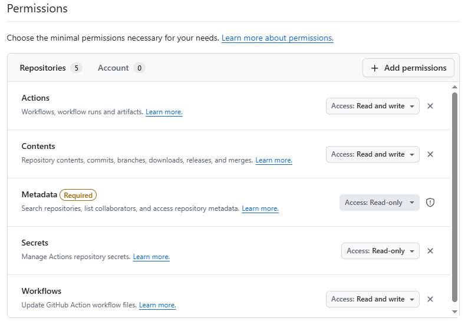

# autoimage

A small web editor for the `Dockerfile` of this repository, plus a button to
trigger a GitHub Actions workflow that builds the Dockerfile and pushes the
resulting image to **GitHub Container Registry (`ghcr.io`)**.

The application is written in Rust (Axum) and serves a single HTML page plus
a small JSON API. The legacy Python / Streamlit implementation has been
removed.

## What changed

- Image source: switched from `registry.cn-shenzhen.aliyuncs.com` (Aliyun) to
  `proxy.vvvv.ee` (image info / download API). The editor exposes
  `POST /api/image/info` and `POST /api/image/download` to look up
  upstream images.
- Frontend and backend: rewritten in Rust (`axum` + `tokio` + `reqwest`),
  single binary, no npm build step.
- Dockerfile editor: `GET /api/dockerfile`, `PUT /api/dockerfile`,
  `GET /api/dockerfile/backups`, `GET /api/dockerfile/backups/:name`. Each
  `PUT` creates a timestamped backup next to the file
  (`Dockerfile.bak.YYYYMMDD-HHMMSS`, in local time; collisions get `.2`,
  `.3`, …).
- Build trigger: `POST /api/build` calls
  `POST /repos/{owner}/{repo}/actions/workflows/{file}/dispatches` on
  GitHub. The application no longer runs `git push` from the host.
- Push target: `ghcr.io/<github-owner>/<image>:<version>`, authenticated
  with the workflow's built-in `GITHUB_TOKEN`.

## GitHub setup

1. **Workflow permissions**: in the repo, go to
   `Settings → Actions → General → Workflow permissions` and ensure
   "Read and write permissions" is selected (or grant `packages: write`
   per-workflow via the `permissions:` block we already set).
2. **Packages** (only when pushing to an *organisation*): in the org,
   `Settings → Packages → Enable`. Public/private visibility is per-package.
3. **Trigger token**: create a fine-grained PAT or classic PAT with
   `repo` + `workflow` scopes, restricted to this repository. This becomes
   the `GH_TOKEN` env var on the host running autoimage.

The old `DOCKER_USERNAME` / `DOCKER_PASSWORD` secrets are no longer used.

## Configuration (`config.toml`)

```toml
bind = "127.0.0.1:8080"
proxy_base_url = "https://proxy.vvvv.ee"

[github]
owner = "fantasy-mark"
repo = "AutoImage"
workflow_file = "build.yml"
default_branch = "main"

[target]
repo = "ghcr.io"
# namespace defaults to github.owner when omitted
```

All values may be overridden by environment variables; `GH_TOKEN` is
**only** read from the environment, never from the file.

| Env var               | Overrides                 |
| --------------------- | ------------------------- |
| `APP_BIND`            | `bind`                    |
| `PROXY_BASE_URL`      | `proxy_base_url`          |
| `GH_OWNER`            | `github.owner`            |
| `GH_REPO`             | `github.repo`             |
| `GH_WORKFLOW`         | `github.workflow_file`    |
| `GH_DEFAULT_BRANCH`   | `github.default_branch`   |
| `TARGET_REPO`         | `target.repo`             |
| `TARGET_NAMESPACE`    | `target.namespace`        |
| `GH_TOKEN`            | (required for `/api/build`, env-only) |

## Run locally

```sh
cargo run --release
# open http://127.0.0.1:8080/
```

If you want to call `/api/build`, export `GH_TOKEN` first:

```sh
export GH_TOKEN=ghp_xxxxxxxx
cargo run --release
```

## Run in a container

The application Dockerfile lives in `app/Dockerfile` (the `Dockerfile` at
the repo root is the one the editor manages):

```sh
docker build -f app/Dockerfile -t autoimage .
docker run --rm -p 8080:8080 \
  -e GH_TOKEN=ghp_xxxxxxxx \
  -v "$PWD/Dockerfile":/app/Dockerfile \
  autoimage
```

## API summary

| Method | Path                                  | Purpose                                  |
| ------ | ------------------------------------- | ---------------------------------------- |
| GET    | `/`                                   | Editor HTML page                         |
| GET    | `/static/*`                           | CSS / JS                                 |
| GET    | `/api/dockerfile`                     | Read current `Dockerfile`                |
| PUT    | `/api/dockerfile`                     | Save `Dockerfile` (creates backup first) |
| GET    | `/api/dockerfile/backups`             | List timestamped backups (newest first)  |
| GET    | `/api/dockerfile/backups/:name`       | Read a specific backup                   |
| POST   | `/api/image/info`                     | Proxy `proxy.vvvv.ee/api/image/info`     |
| POST   | `/api/image/download`                 | Proxy `proxy.vvvv.ee/api/image/download` |
| POST   | `/api/build`                          | Trigger GitHub Actions workflow          |
# [PAT](https://github.com/settings/personal-access-tokens)

